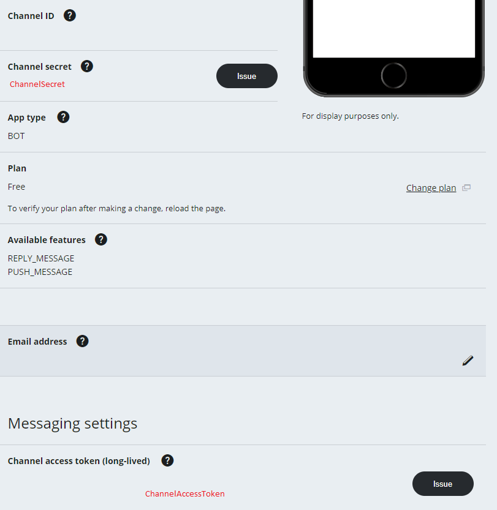
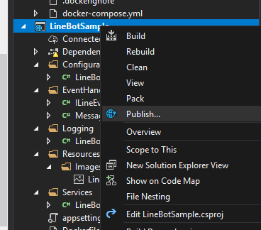
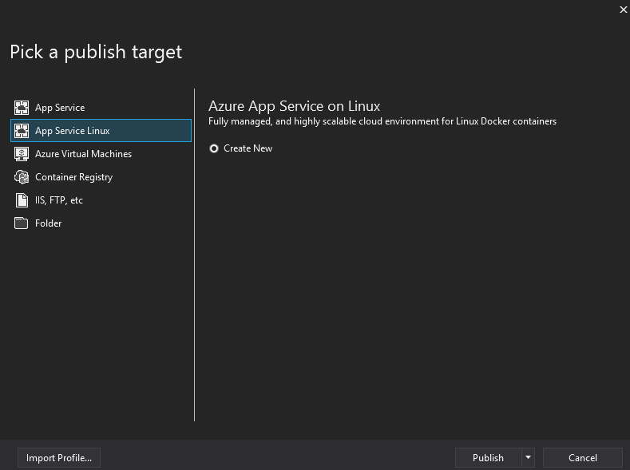
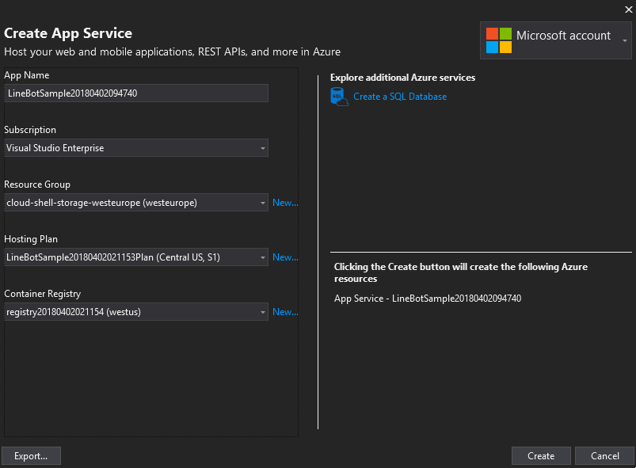
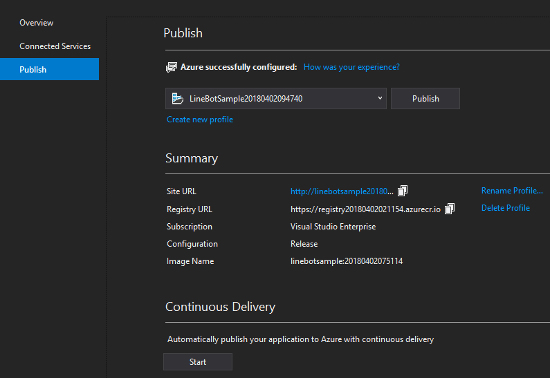
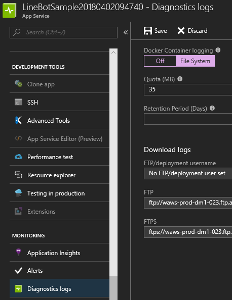
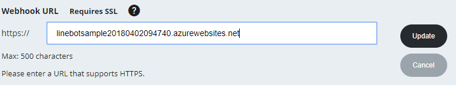
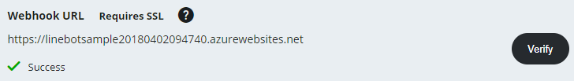
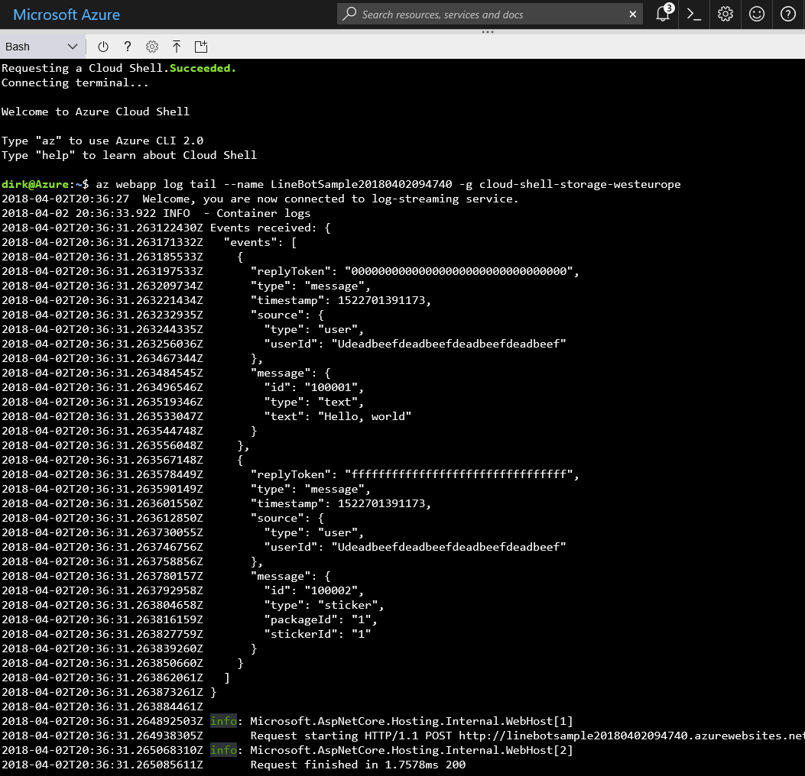

# line-bot-sdk-dotnet-sample

[](https://raw.githubusercontent.com/dlemstra/line-bot-sdk-dotnet/master/License.txt)
[](https://twitter.com/MagickNET)

This project contains a sample of how [line-bot-sdk-dotnet](https://github.com/dlemstra/line-bot-sdk-dotnet) can be used in a .NET web application.

### What do I need to use this sample in a bot channel?

To use this sample in a bot channel you will need the following:

- Visual Studio 2017
- Docker
- Azure account

The sample project also works when you run the resulting Docker container on another platform than Azure but because of the integration with Azure inside
Visual Studio you can run this sample very quickly inside Azure.


### How can I use this sample in a bot channel?

The first step is cloning the repository:

```
Microsoft Windows [Version 10.0.16299.309]
(c) 2017 Microsoft Corporation. All rights reserved.

C:\line-bot-sdk-dotnet-sample>git clone https://github.com/dlemstra/line-bot-sdk-dotnet-sample.git.
Cloning into '.'...
remote: Counting objects: 29, done.
remote: Compressing objects: 100% (19/19), done.
remote: Total 29 (delta 5), reused 29 (delta 5), pack-reused 0
Unpacking objects: 100% (29/29), done.
Checking connectivity... done.
```

After cloning this project you will need to open the solution in the root of the project: `LineBotSample.sln`. This project requires Docker to be installed.
When the projected is opened with Visual Studio 2017 you will receive an examplantion on how to install Docker when this is not yet installed.

The next step is modifying the file `appsettings.json` in the `LineBotSample` project. This file has the following content:

```json
{
  "LineConfiguration": {
    "ChannelAccessToken": "YourChannelAccessToken",
    "ChannelSecret": "YourChannelSecret"
  }
}
```

The values that need to entered in the `LineConfiguration` block can be found on the settings page of the bot channel:



The next step is to publish the `LineBotSample` to Azure. This can be done with a right-click on the LineBotSample project:



This will open the following dialog:



On this dialog the option `App Service Linux` should be picked and the publish button can be pressed that will open the following dialog:



When the create button on that dialog is pressed the App Service will be created in Azure and the following dialog will be shown:



On this page the `Site URL` should be copied and pasted in the appsettings.json. `http` should be changed into `https` and `/resources/` should be added to the end url.

```json
{
  "LineBotSampleConfiguration": {
    "ResourcesUrl": "https://linebotsample20180402094740.azurewebsites.net/resources/"
  }
}
```

After setting this value the `Publish` button in the last dialog should be pressed to update the App Service.

And the last step is setting the `WebHook` in the channel but to see what is happening when the webhook is verified it is wise to enable diagnostics logs open a Cloud Shell in Azure:



In the Cloud Shell the command below needs to be entered. The value for `--name` should be the name of the App Service, and `-g` the name of the Resource Group.

```
dirk@Azure:~$ az webapp log tail --name LineBotSample20180402094740 -g cloud-shell-storage-westeurope
```

The `WebHook` should also be set on the settings page of the channel.



After clicking on `Update` the `Verify` button will become visible.



Pressing this button will send a message to the bot and this should be shown in the Cloud Shell.



This bot now only handles `LineEventType.Message` and responds to 3 messages.

- When the message contains `ping` the bot will reply with `pong`.
- When the message contains `user` the bot will reply with a message the contains information of the user.
- When the message contains `logo` the bot will reply with an image that is the logo of this project.

The code for the event handler can be found in [src/LineBotSample/EventHandlers/MessageEventHandler.cs](src/LineBotSample/EventHandlers/MessageEventHandler.cs). Feel free to modify this
sample and play around with it. This project is also open to PR's with extra samples.